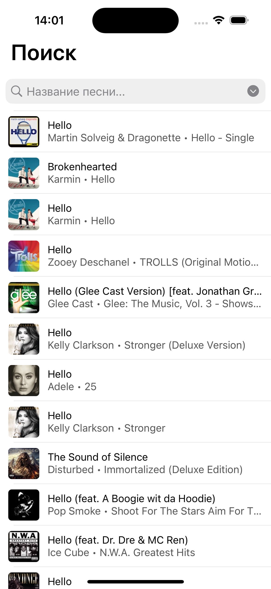
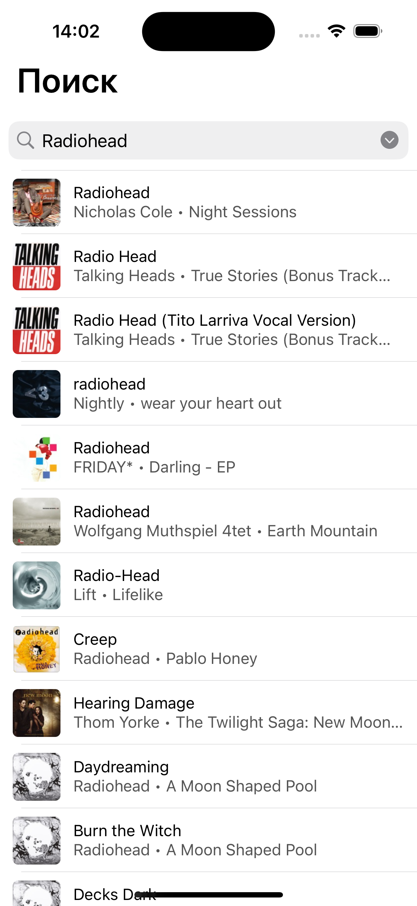
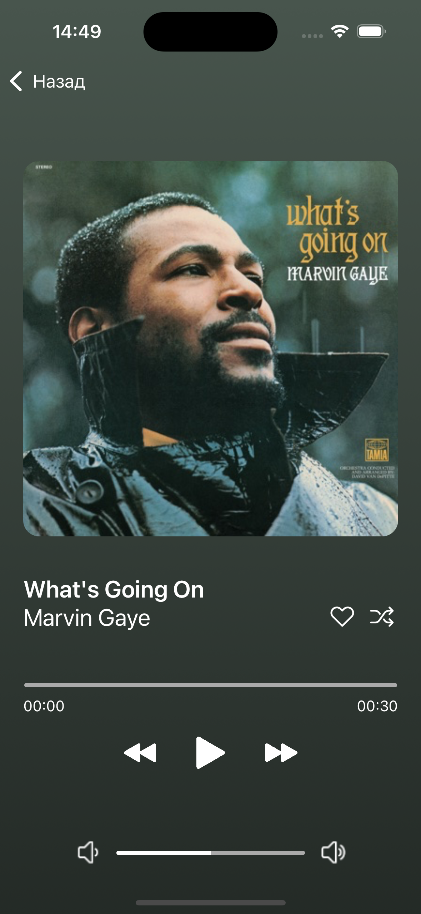
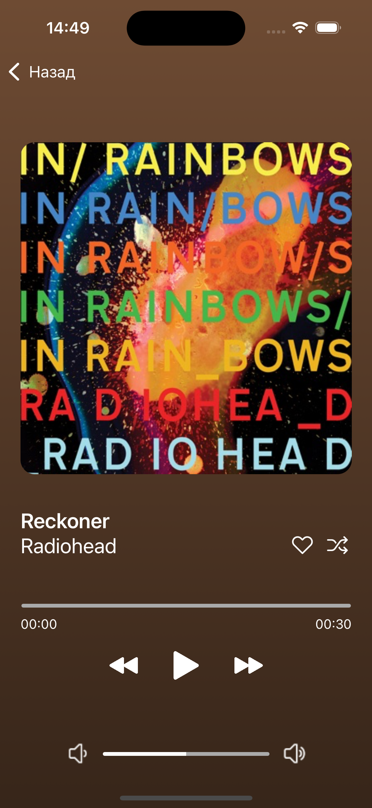

# Music App Project

Клиент-серверное приложение на основе iTunes Search API. Реализована возможность воспроизводить 30-секундное превью трека.

## Содержание
- [Технологии](https://github.com/evgeniasmirnova/iTunesMusicProject#технологии)
- [Начало работы](https://github.com/evgeniasmirnova/iTunesMusicProject?tab=readme-ov-file#начало-работы)
- [Возможности](https://github.com/evgeniasmirnova/iTunesMusicProject?tab=readme-ov-file#возможности)

## Технологии
- UIKit
- Alamofire
- SnapKit
- KingFisher
- GCD
- Pagination
- Architecture: MVP

## Начало работы

Клонировать репозиторий в нужную папку с помощью команды:
```
git clone git@github.com:evgeniasmirnova/ItunesMusicProject.git
```

## Возможности

### Экран поиска
На данный экран выводится список песен с базовой информацией о названии, исполнителе, альбоме и небольшой обложкой, по умолчанию — поиск по ключевому слову "hello".

  

#### Пагинация
В приложении реализована пагинация для последовательного отображения песен при скролле таблицы.

 

#### Поиск
Поиск осуществляется по ключевому слову после введения полного запроса.


### Экран плеера
Экран содержит большую обложку, название трека и исполнителя. Цвет фона динамический и подстраивается под обложку. С помощью слайдера можно перематывать трек свайпом по дорожке. Есть возможность регулировать громкость. 

  
