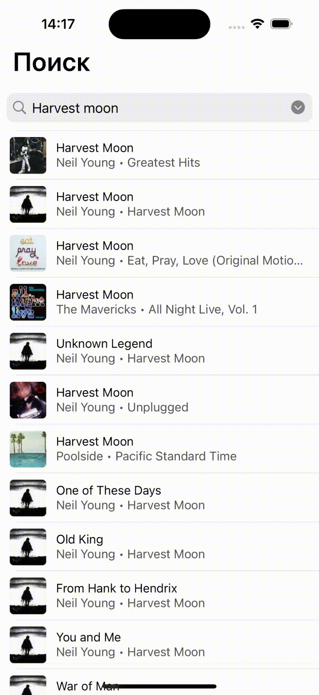

# Music App Project

Клиент-серверное приложение на основе iTunes Search API. Реализована возможность воспроизводить 30-секундное превью трека.

## Содержание
- Технологии
- Начало работы
- Возможности

## Технологии
- UIKit
- Alamofire
- SnapKit
- KingFisher
- GCD
- Pagination
- Architecture: MVP

## Начало работы

Клонировать репозиторий в нужную папку с помощью команды:
```
git clone git@github.com:evgeniasmirnova/ItunesMusicProject.git
```

## Возможности

### Экран поиска

  

 


### Экран плеера

  
